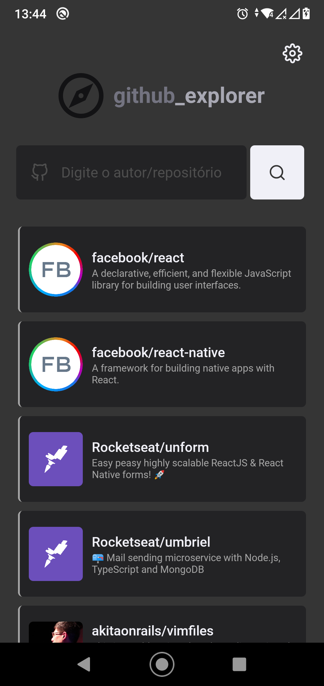
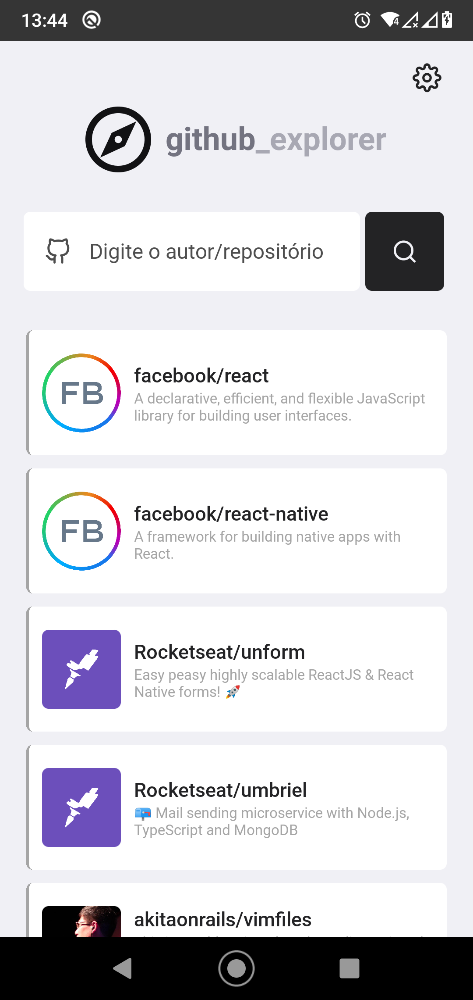
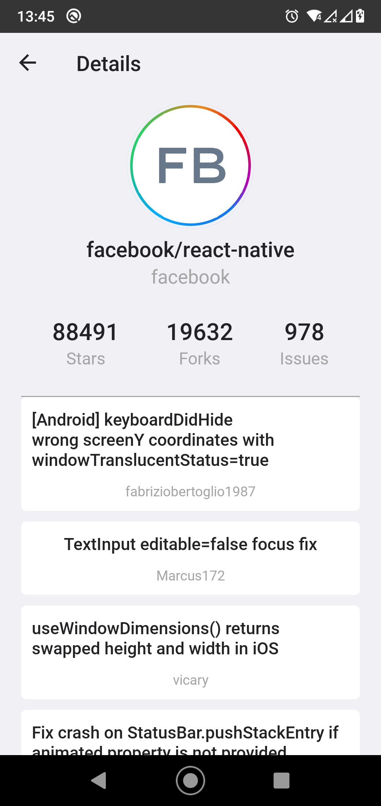

# :bulb: Sobre o projeto

Este projeto trata-se de uma aplicação mobile construída com React Native e TypeScript.

Inicialmente, esta aplicação foi desenvolvida para web, e sem a possibilidade de trocar o tema. Pensando nisso, resolvi criar minha própria versão para mobile com o Theme Switcher.

Dentre as principais ferramentas utilizadas, destaco a Context API do React para gerenciar estados entre componentes, Styled Components para faciltar a estilização e aplicar um plus (theme switcher), e um custom hook para temas personalizados.

Na aplicação você será capaz de:
- Adicionar seus repositórios favoritos do GitHub
- Mantê-los salvos no AsyncStorage para evitar novas request à API do GitHub
- Acessar os detalhes de cada repositório (stars, forks e issues)
- Listar as Issues
- Alterar entre tema dark e claro

## :paperclip: Demonstação sobre o que foi feito

#### Adicionando repositório, acessando seus detalhes e alterando o tema:

<!--  -->

## :pencil2: Considerações finais sobre o projeto

Este projeto foi desenvolvido com o propósito em aplicar meus conhecimentos obtidos até então a fim de reforçar o que foi aprendido e dito em aula.

 #learn&practice :satisfied:

## :pushpin: Sinta-se livre para clonar

Basta colar `git clone https://github.com/Bruno-hub19/GitHub-explorer-mobile`  no seu terminal

---

<strong>Feito com :purple_heart: por Bruno Nascimento</strong>

